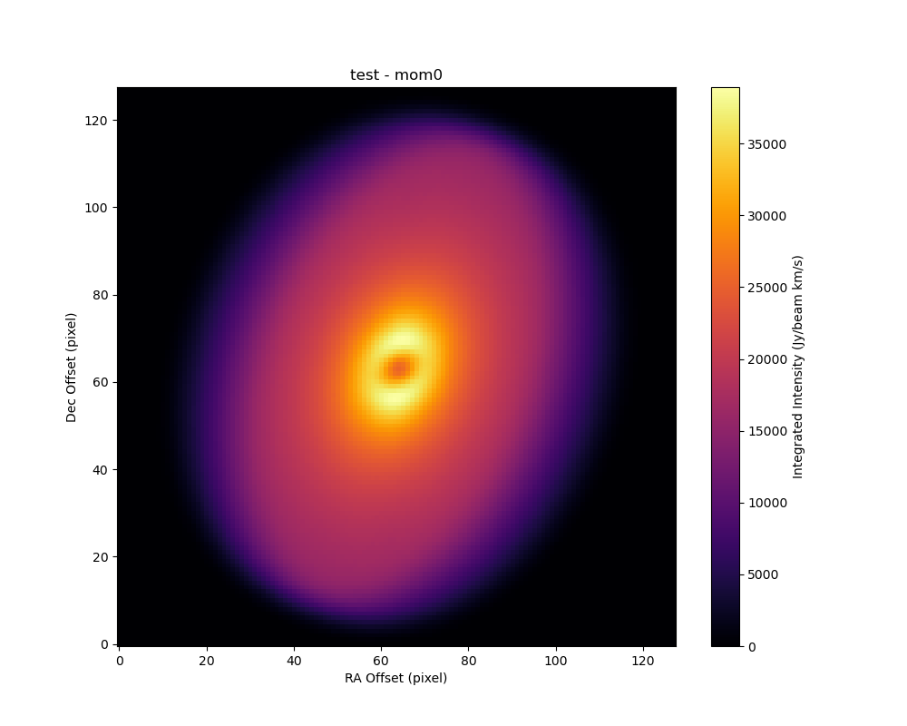
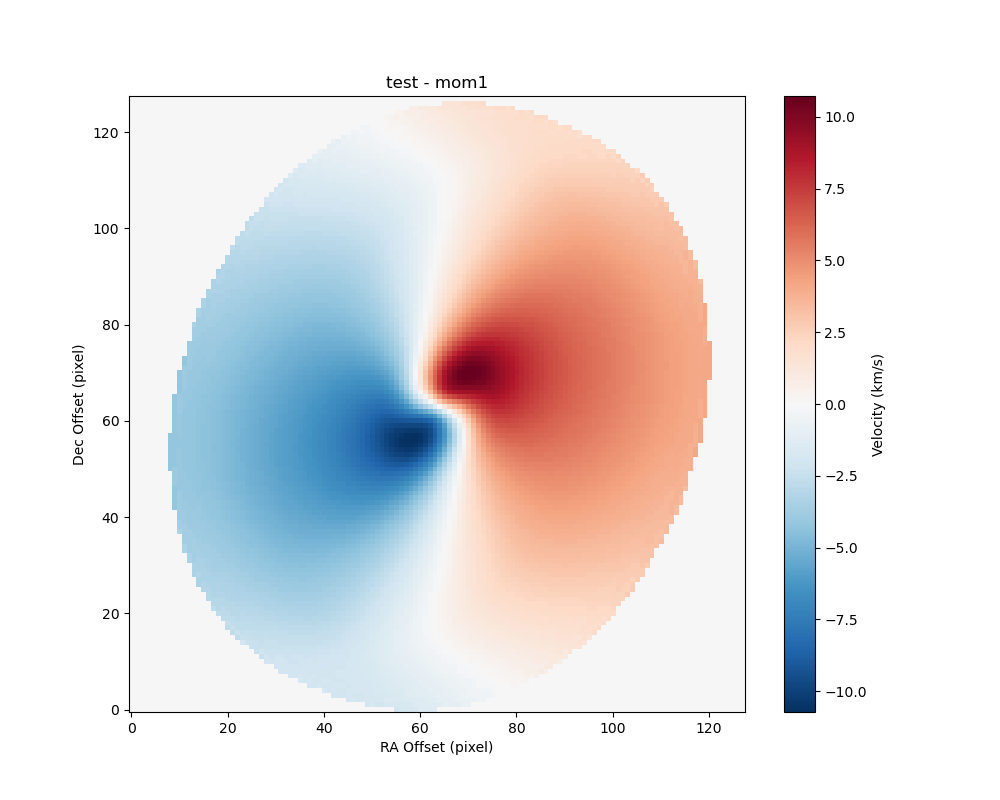
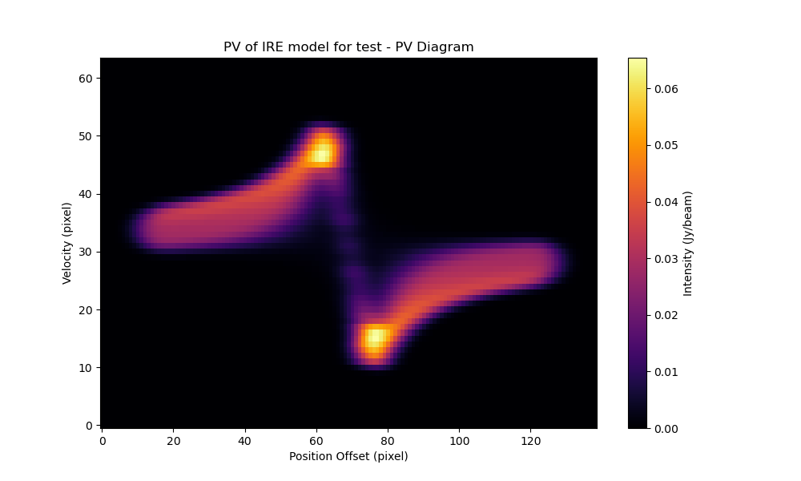

# FERIA-Python

**FERIA (Flat Envelope Model with Rotation and Infall under Angular Momentum Conservation) - Python Implementation**

[中文文档 (Chinese Documentation)](README_CN.md)

FERIA-Python is a pure Python implementation of the FERIA model, designed for simulating and fitting the kinematics of Infalling-Rotating Envelopes (IRE) and Keplerian Disks around protostars. It provides tools to generate 3D data cubes, Position-Velocity (PV) diagrams, and Moment maps, as well as a simple grid search fitting module to constrain physical parameters from observational data (now supports Moment-1 velocity fields).

## Features

- **Forward Modeling**: Generate synthetic spectral line observations of protostellar envelopes.
  - Supports Infalling-Rotating Envelope (IRE) and Keplerian Disk kinematics.
  - Generates FITS Data Cubes (RA, Dec, Velocity).
  - Generates PV Diagrams and Moment Maps (0 & 1).
- **Visualization**: Automatic generation of PNG plots for quick inspection.
- **Fitting Engine**: Built-in grid search framework to fit models to observational data (Moment-1 velocity fields).
  - Efficient in-memory calculation (no disk I/O overhead during fitting).
  - Automatic loss calculation (MSE/Chi-square) and visualization (1D curves, 2D heatmaps).
- **Pure Python**: Easy to install and modify, leveraging `numpy` and `astropy`.

## Dependencies

- python >= 3.8
- numpy
- astropy
- matplotlib

Install dependencies via pip:
```bash
pip install numpy astropy matplotlib
```

## Quick Start

### 1. Generate a Single Model
Run `example.py` to generate a standard IRE model. This script demonstrates how to define physical parameters and generate data products.

```bash
python example.py
```
**Output**: `example_cube.fits` (Cube), `example_PV.fits`, `example_mom0.fits`, `example_mom1.fits`, and corresponding PNG plots.

#### Example Output
<div align="center">
  
  
  
</div>

### 2. Parameter Fitting Demo
Run `fit_demo.py` to see the fitting engine in action. It generates a "fake" observation and then recovers the input parameters using a grid search.

```bash
python fit_demo.py
```
**Output**: `fit_results_demo_rcb/` folder containing loss heatmaps (e.g., Mass vs Centrifugal Radius).

#### Example Output
<div align="center">
  
</div>

## File Structure & Description

| File | Description |
|------|-------------|
| **`models.py`** | Core logic for the `IREModel` class. Handles physics calculation, 3D mesh generation, and projection. |
| **`fitter.py`** | Contains the `ModelFitter` class and `fit_grid` function for parameter estimation. |
| **`params.py`** | Defines the `SourceParams` dataclass for managing physical and observational parameters. |
| **`sky.py`** | Implements the `SkyPlane` class, handling projection from 3D mesh to 2D sky plane and convolution. |
| **`mesh.py`** | Defines the 3D coordinate grid (`Mesh`) and handles coordinate transformations. |
| **`pv_diagram.py`** | Logic for extracting Position-Velocity (PV) slices from the data cube. |
| **`io_utils.py`** | Handles FITS file input/output (Cube, PV, Moments) with correct WCS headers. |
| **`plot_utils.py`** | Utilities for visualizing FITS data using `matplotlib`. |
| **`coords.py`** | Helper functions for coordinate conversion (RA/Dec <-> Arcsec). |
| **`config.py`** | Global constants (physical constants, units). |
| **`example.py`** | **Entry Point**. Example script for generating a single model and a model grid. |
| **`fit_demo.py`** | **Entry Point**. Demonstration script for fitting model parameters to data. |

## Usage Guide

### Defining Parameters
Parameters are defined in a dictionary (see `example.py`) and passed to `SourceParams`. Key parameters include:
- `mass_msun`: Protostellar mass (Solar masses).
- `rcb_au`: Centrifugal barrier radius (AU).
- `inc_deg`: Inclination angle (degrees).
- `rout_au`: Envelope outer radius (AU).

### Grid Search Fitting
To fit your own data:
1. Prepare your observation Moment-1 FITS file.
2. Create a script similar to `fit_demo.py`.
3. Define a `base_params` dictionary matching your source's geometry.
4. Define a `grid` dictionary with parameters to vary.
5. Call `fit_grid(obs_file, base_params, grid, ...)`.

```python
from fitter import fit_grid

# ... define base_params ...

grid = {
    'mass_msun': np.arange(100, 200, 10),
    'inc_deg': np.arange(30, 60, 5)
}

fit_grid("my_observation_mom1.fits", base_params, grid, output_dir="my_results")
```
